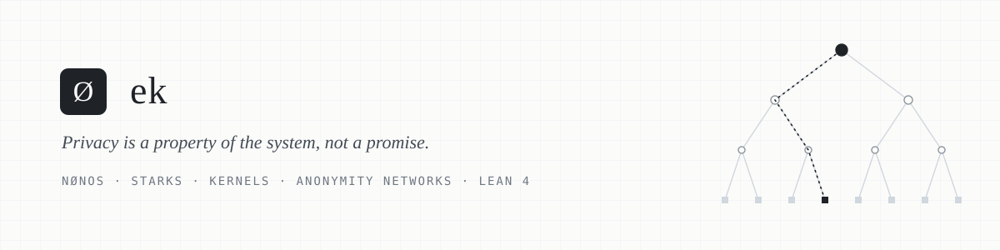

<picture>
  <source media="(prefers-color-scheme: dark)" srcset="assets/banner-dark.svg">
  
</picture>

<br>

I am **ek**. I build **NØNOS**: an operating system and a set of protocols where privacy comes
from how the system is built, not from the good intentions of anyone.

I work where cryptography meets systems: kernels that trust as little as possible, proofs that a
blockchain can check on its own, and networks that leave nothing behind worth collecting.

<br>

## What I believe

**Privacy is not secrecy.** Secrecy is hiding something wrong. Privacy is choosing what you
reveal and to whom. It is the difference between a sealed letter and a postcard. We have been
living on postcards for twenty years.

**Trust is a cost.** Every trusted setup, every operator and every server in the middle is a place
where the system can be broken, bought or subpoenaed. I would rather prove a statement than ask
you to believe it.

**Metadata is data.** Who talked to whom, and when and how often, says more than the message
itself. A system that encrypts content but leaks the graph has solved the easy half.

**Proof over promise.** If a property matters, it should be checked by the machine: by a
verifier on chain, by a proof in Lean, or by a test that fails when the property breaks. A
privacy policy is not a property.

**Honesty about limits.** Every system has a boundary where its guarantees stop. The good ones
tell you exactly where it is.

<br>

## What I work on

<table>
  <tr>
    <td width="50%" valign="top">
      <b>STARKs on Ethereum</b><br>
      <sub>Transparent proofs, verified in the EVM itself, with no trusted setup and no pairings:
      FRI, DEEP, Goldilocks, and the gas behind each of them.</sub>
    </td>
    <td width="50%" valign="top">
      <b>Operating system kernels</b><br>
      <sub>A capability-based microkernel in Rust, no_std, RAM-resident and running signed
      capsules. It starts from zero state and remembers nothing it does not have to.</sub>
    </td>
  </tr>
  <tr>
    <td width="50%" valign="top">
      <b>Anonymity networks</b><br>
      <sub>Mixnets, onion routing and traffic analysis resistance: how to move bytes without
      moving identities.</sub>
    </td>
    <td width="50%" valign="top">
      <b>Formal methods</b><br>
      <sub>Lean 4 for the mathematics under the protocols, and symbolic execution and invariant
      testing for the code on top of them.</sub>
    </td>
  </tr>
</table>

<br>

## A proof, checked by the machine

The STARKs I verify on Ethereum live in the Goldilocks field. Two facts hold the whole
construction up, and I prefer to have them checked by a proof kernel rather than recalled from memory:

```lean
def p : Nat := 2 ^ 64 - 2 ^ 32 + 1

/-- p - 1 has a subgroup of order 2^32: room for FFTs over four billion points. -/
theorem two_adic : p - 1 = 2 ^ 32 * (2 ^ 32 - 1) := by decide

/-- the Euler criterion: 7 is not a square mod p, so X^2 - 7 is irreducible and
    F_p[X] / (X^2 - 7) is the extension field the verifier draws its challenges from. -/
theorem seven_is_a_nonresidue : powMod 7 ((p - 1) / 2) p = p - 1 := by decide +kernel

/-- omega = 7^(2^32 - 1) has order exactly 2^32. -/
theorem omega_order : powMod omega (2 ^ 32) p = 1 ∧ powMod omega (2 ^ 31) p = p - 1 := by decide +kernel
```

<sub>Full file: <a href="lean/Goldilocks.lean"><code>lean/Goldilocks.lean</code></a>. Every theorem depends on no axioms at all; the kernel evaluates the arithmetic itself. CI re-checks it on every push.</sub>

<br>

## Tools I reach for

<p>
  
  
  
  
  
  
  
  
</p>

<br>

<p align="center">
  <sub><i>Nothing to hide is not the same as nothing to protect.</i></sub>
</p>
